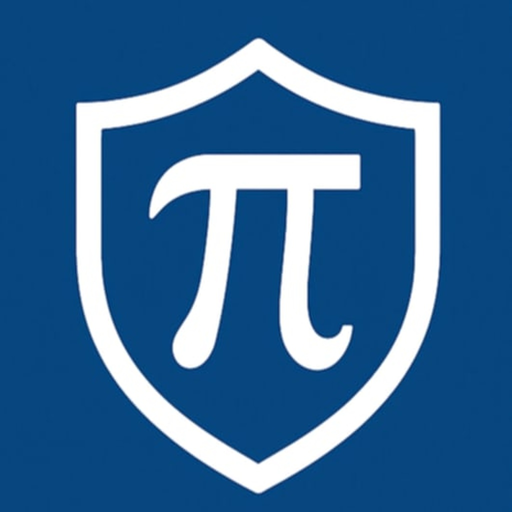

🚨 Safeπ – Pi Network Security Tool

 A safety tool designed to protect Pioneers from scams, phishing sites, and fake Pi-related webpages. 

🔍 What is Safeπ?

Safeπ is a security-focused web application built for the Pi community.
It allows users to instantly verify any website URL and determine whether it is safe, suspicious, or potentially harmful.

As scams targeting Pioneers continue to rise, Safeπ provides a simple and essential layer of protection inside the Pi ecosystem.

🚀 Features
✔ URL Safety Scanner

Detects phishing and fake Pi sites

Checks SSL certificate issues

Identifies scam-like patterns

Flags dangerous redirects

Provides instant safety results

✔ Pi SDK v2 Integration

Works inside Pi Browser

Supports user-to-app Pi payments

Approves & completes payments through backend API

Fully testnet-compatible

✔ User-Friendly Interface

Clean mobile-first design

Fast results

Dark & light themes

Built for everyday Pi users

🧩 Tech Stack
Frontend

Next.js 14

React 18

Pi SDK v2

Deployed on Render

Backend

Node.js

Express.js

Axios

CORS

Hosted on Render

💳 Pi Payment Flow

Safeπ uses the official Pi Payment API:

User initiates “Pay 0.1π”

Pi Browser opens Wallet

Backend approves payment (/api/create-payment)

Wallet submits transaction

Backend completes payment (/api/complete-payment)

User returns to Safeπ

This process is fully functional and verified.

📦 Deployment

Safeπ is deployed using:

Render (backend)

Render/Netlify/Vercel (frontend)

HTTPS required for Pi Browser

Domain verified in Pi Developer Portal

🎯 Vision

Safeπ aims to reduce scam activity in the Pi community by helping Pioneers verify URLs before interacting with them—building a safer and more trustworthy Pi ecosystem.

👤 Author

Safeπ Development Team (2025)

---

## 📺 Safeπ Demo Videos

### 🔹 Short Demonstration (YouTube Shorts)
👉 [Watch Short Demo](https://www.youtube.com/shorts/6wYBQO_D1ok)

### 🔹 Full App Walkthrough

---

Repository maintained by the creator of Safeπ.

🤝 Contributing

Feedback and contributions are welcome.
Open an issue or submit a pull request anytime.
